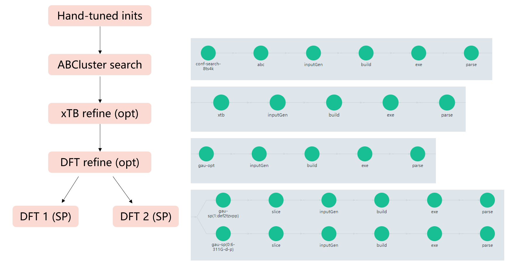

This is an automated conformation search workflow[^ref] using dflow_refiner OPs.

The workflow and argo UI are shown in Figure 1.

Figure 1. Conformation search workflow and Argo UI.

In the final DFT refine step, a slice feature is implemented. More information about steps slice feature could be found in [test_steps_slc_in_para](./../unit_test/test_steps_slc_in_para.py).

[^ref]:DOI: 10.1007/s11224-014-0430-6
