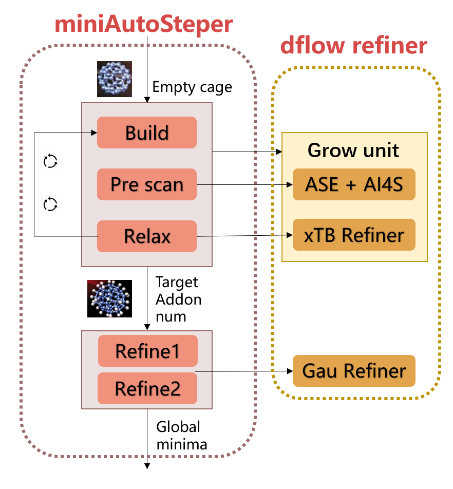
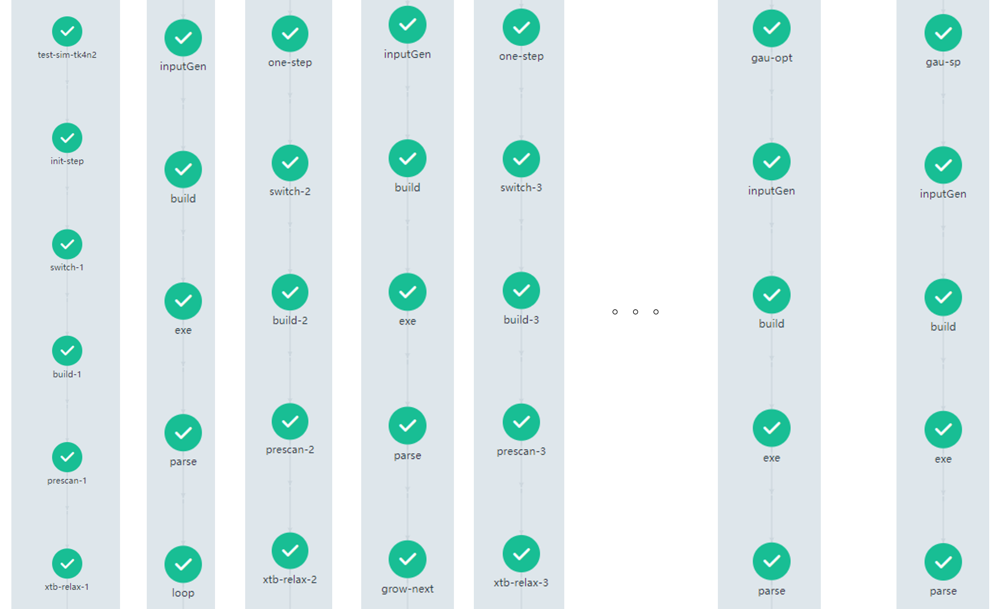

This is a simplified version of [AutoSteper]([GitHub - Franklalalala/AutoSteper: Automated Stepwise Addition Procedure for Extrafullerene.](https://github.com/Franklalalala/AutoSteper)), aiming to automate the stepwise addition workflow in extrafullerene chemistry[^ref]. 

Related files are arranged into three folders:

1. [test_build](./test_build): Unit test for the extrafullerene building OP. [first](./test_build/first/) for the first step. [one](./test_build/one/) is designed to build with previous addon sites.
2. [test_prescan](./test_prescan): Unit test for customized ASE refiner.
3. [test_miniAutoSteper](./test_miniAutoSteper): Test for the entire miniAutoSteper workflow. [production](./test_miniAutoSteper/production) is an amplified version of [test_miniAutoSteper](./test_miniAutoSteper/test_miniAutoSteper.py) (cutoff is enlarged)

The workflow of miniAutoSteper could be summarized in Figure 1.

Figure 1. miniAutoSteper workflow.

In general, a thermodynamic sampling algorithm performs a coarse **growth simulation** till the ideal addon number is achieved. After that, high accuracy method to **refine** the results.

On top of dflow_refiner, only the build module needs to be specifically designed. And to better perform growth simulation, I grouped the build, pre-scan, and relax modules to the grow unit, which is also a refiner.

The argo UI of this workflow is shown in Figure 2.

Figure 1. miniAutoSteper argo UI.

[^ref]:DOI: 10.1021/acs.jctc.7b01048
