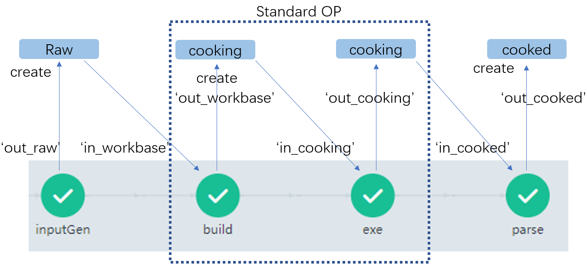
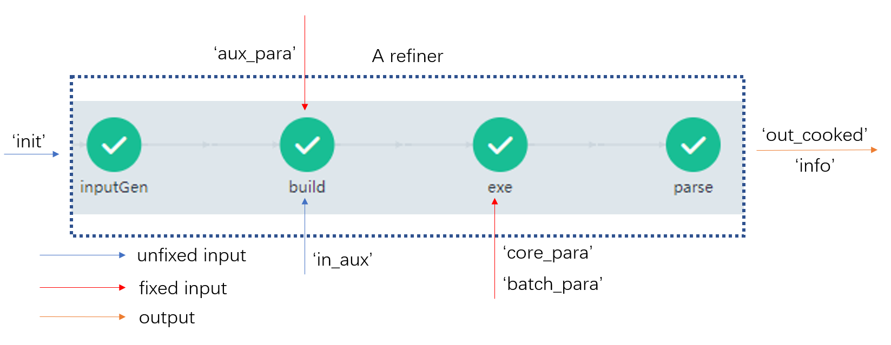

This is a simple tutorial to build a VASP refiner from scratch. It was arranged into 3 sections: Background, Components OP design, and Refiner OP design.

[TOC]

## A Background

### A.1 What is dflow?

[dflow]([GitHub - dptech-corp/dflow](https://github.com/dptech-corp/dflow)) is an open-source Python framework to build workflows employing the [Argo]([Home | Argo (argoproj.github.io)](https://argoproj.github.io/)) engine. A detailed introduction could be found in [intro]([GitHub - dptech-corp/dflow](https://github.com/dptech-corp/dflow)) and [tutorials]([dflow/tutorials at master · dptech-corp/dflow · GitHub](https://github.com/dptech-corp/dflow/tree/master/tutorials)), some Chinese blogs could be found in [zhihu]([Jiankun Pu - 知乎 (zhihu.com)](https://www.zhihu.com/people/jiankun-pu/posts)) and [csdn]([frank_haha的博客_CSDN博客-领域博主](https://blog.csdn.net/frank_haha?type=blog)). 

### A.2 What is refiner?

dflow_refiner is a dflow-driven python OP library for integrating multiple calculators. Refiner is the core unit to perform automated calculations employing specific software. Currently, a refiner consists of 4 components:

1. inputGen: generates input files
2. build: build a workbase with auxiliary files (if there is one)
3. exe: execute input files
4. parse: parse results to standard formats

There are standard OPs in dflow_refiner for build and exe. What we need to do is design customized OP for software-specific scenarios.

After design and test of components OP, we'll chain them to refiner OP.

 ### A.3 Application scenario for VASP refiner

This tutorial will focus on a simple scenario for VASP refiner. As we all know, Cu is a bulk system in the face-centered cubic stacking mode. To testify this conclusion, different Cu units are built by [preparation](./simple_prepare_xyz.py). What we do next is to build a refiner to refine these units in batch style and rank them to justify the stacking mode.

## B Components OP design

### B.1 Folder system and name convention

Before we started, I'd like to address the folder system.

1. raw: input files preparation, generated in inputGen step and passed to build step.
2. cooking: the real workbase to conduct heavy computing, generated in build step and passed to exe step. Then passed to the parse step.
3. cooked: the refined results, typically the optimized structure in XYZ format, this folder is generated in the parse step and outputted as the final results.

And some name conventions need to be mentioned (see Figure 1).



<center>Figure 1. Folder system and name convention for a refiner.</center>

For every step, the input artifacts are denoted in the prefix 'in', and the output artifacts are in the prefix 'out'. The build and exe step are standardized, but the interface needs to be notified.

### B.2 Design inputGen and parse

[ASE]([Atomic Simulation Environment — ASE documentation (dtu.dk)](https://wiki.fysik.dtu.dk/ase/)) is an outstanding tool to create input files and parse output results. The inputGen OP is established on the [write_vasp]([Format Specific Options — ASE documentation (dtu.dk)](https://wiki.fysik.dtu.dk/ase/ase/io/formatoptions.html?highlight=write_vasp#ase.io.vasp.write_vasp)) function and the parse OP is [read_vasp_out]([Format Specific Options — ASE documentation (dtu.dk)](https://wiki.fysik.dtu.dk/ase/ase/io/formatoptions.html?highlight=read_vasp_out#ase.io.vasp.read_vasp_out)).

The implementation logic is summarized as below:

inputGen: Assuming we have structures in XYZ format, we create a loop to read them and re-dump them to the POSCAR format, but the identical name is preserved (to build an identical workbase).

parse: Assuming we have cooked results in OUTCAR format. We create a loop to read results and re-dump them to the XYZ format for the next refinement. The energy information is kept during parse to perform ranking.

Here is my realization:

The inputGen OP:

```python
class vaspInGen(OP):
    def __init__(self):
        pass

    @classmethod
    def get_input_sign(cls):
        return OPIOSign({
            'init': Artifact(Path),
        })

    @classmethod
    def get_output_sign(cls):
        return OPIOSign({
            'out_raw': Artifact(Path),
        })

    @OP.exec_sign_check
    def execute(
            self,
            op_in: OPIO,
    ) -> OPIO:
        from ase.io import read
        from ase.io.vasp import write_vasp

        cwd_ = os.getcwd()
        os.makedirs('raw', exist_ok=True)
        dst = os.path.abspath('raw')
        os.chdir(op_in['init'])

        for a_file in os.listdir('./'):
            file_name = os.path.splitext(a_file)[0]
            atoms = read(a_file)
            write_vasp(file=os.path.join(dst, file_name), atoms=atoms)

        os.chdir(cwd_)
        op_out = OPIO({
            'out_raw': Path('raw'),
        })
        return op_out
```

The parse OP:

```python
class vaspParser(OP):
    def __init__(self):
        pass

    @classmethod
    def get_input_sign(cls):
        return OPIOSign({
            'in_cooked': Artifact(Path)
        })

    @classmethod
    def get_output_sign(cls):
        return OPIOSign({
            'out_cooked': Artifact(Path),
            'info': Artifact(Path)
        })

    @OP.exec_sign_check
    def execute(
            self,
            op_in: OPIO,
    ) -> OPIO:
        from ase.io.vasp import read_vasp_out
        from ase.io import write

        cwd_ = os.getcwd()
        name = 'cooked'
        dst = os.path.abspath(name)
        os.makedirs(dst, exist_ok=True)
        name_list = []
        e_list = []
        os.chdir(os.path.join(op_in['in_cooked'], 'cooking'))
        for a_job in os.listdir('./'):
            old_path = os.path.join(a_job, 'OUTCAR')
            if os.path.exists(old_path):
                name_list.append(a_job)
                out_atoms = read_vasp_out(old_path)
                e = out_atoms.get_potential_energy() / len(out_atoms)
                e_list.append(e)
                new_xyz_path = os.path.join(dst, a_job + '.xyz')
                write(new_xyz_path, images=out_atoms)
        os.chdir(cwd_)
        info = pd.DataFrame({'name': name_list, 'e': e_list})
        info = info.sort_values(by='e')
        info.index = sorted(info.index)
        info.to_pickle('info.pickle')
        op_out = OPIO({
            'out_cooked': Path('cooked'),
            'info': Path('info.pickle')
        })
        return op_out
```

### B.3 Parameters for build and exe

As we can see from Figure 1, the build and exe step are standard OP. To make better use of them, we need to know some input parameters. 

For the build step, here I chose the BuildWithAux OP, since a vasp workbase requires four input files, we just generated the POSCAR, rest of files are public for each workbase. This step is to integrate these public files, and the `aux_para` is needed. More information could be found in the [example](./../unit_test/BuildWithAux_test)

For the exe step, here I chose the batchExe OP since we are dealing with multiple jobs. Single job execution could use the simpleExe OP. The sub_slice feature in dflow is also available, see the [example](./../unit_test/sub_path_test). The batchExe OP requires the `core_para` parameters (commandline related) and the `batch_para` parameters (control the batch style). More information could be found in [Fixed_in_para](https://github.com/Franklalalala/dflow_refiner/blob/48c46b4b565c26319b886d741fc5181b617d9251/dflow_refiner/refiners.py#L12).


### B.4 Test of components OP

A simple test of these OPs could be found in [test_components_op.py](./test_components_op.py).

## C Refiner OP design

In this section, we'll seal components OP mentioned above to one big OP, and label them with 'Refiner'. But before we do so, we need to take a look at the inputs and outputs for the entire workflow.



<center>Figure 2. Overview of input and output for a refiner.</center>

The refiner class is inherited from the [steps]([dflow/steps.py at master · dptech-corp/dflow · GitHub](https://github.com/dptech-corp/dflow/blob/master/src/dflow/steps.py)) class, more information about steps class could be found in [this example]([dflow/test_steps.py at master · dptech-corp/dflow · GitHub](https://github.com/dptech-corp/dflow/blob/master/examples/test_steps.py)). Here in dflow_refiner, we classify the inputs to fixed and unfixed. The fixed inputs are parameters that pre-defined before the submit of workflow. The unfixed, usually artifacts, are assigned value during the workflow. Figure 2 presented this classifications. Here in dflow_refiner, we have [Fixed_in_para](https://github.com/Franklalalala/dflow_refiner/blob/48c46b4b565c26319b886d741fc5181b617d9251/dflow_refiner/refiners.py#L12) class to control the entry of fixed parameters. Note that, some of the fixed perameters presented in [Fixed_in_para](https://github.com/Franklalalala/dflow_refiner/blob/48c46b4b565c26319b886d741fc5181b617d9251/dflow_refiner/refiners.py#L12) could be unfixed as in [example](./../miniAutoSteper/test_miniAutoSteper/test_miniAutoSteper.py).

Here is my relization:

```python
class VASP_Refiner(Refiner):
    def __init__(self, in_para: Fixed_in_ref,
                 image: str, executor: DispatcherExecutor,
                 name: str = None, inputs: Inputs = None, outputs: Outputs = None,
                 steps: List[Union[Step, List[Step]]] = None, memoize_key: str = None,
                 annotations: Dict[str, str] = None):
        super(VASP_Refiner, self).__init__(in_para=in_para, image=image, executor=executor, name=name, inputs=inputs,
                                          outputs=outputs,
                                          memoize_key=memoize_key, annotations=annotations, steps=steps)

        self.inputs.artifacts['in_aux'] = InputArtifact()
        self.prefix = self.name
        step_inputGen = Step(
            name="inputGen",
            template=PythonOPTemplate(vaspInGen, image=image),
            artifacts={'init': self.inputs.artifacts['init']},
            key=f"{self.prefix}-inputGen",
        )
        self.add(step_inputGen)

        step_build = Step(
            name="build",
            template=PythonOPTemplate(BuildWithAux, image=image),
            artifacts={"in_workbase": step_inputGen.outputs.artifacts['out_raw'],
                       'in_aux': self.inputs.artifacts['in_aux']},
            parameters={'aux_para': in_para.aux},
            key=f"{self.prefix}-build",
        )

        self.add(step_build)

        step_exe = Step(
            name='exe',
            template=PythonOPTemplate(batchExe, image=image),
            artifacts={'in_cooking': step_build.outputs.artifacts['out_workbase']},
            parameters={'core_para': in_para.exe_core, 'batch_para': in_para.exe_batch},
            executor=executor,
            key=f'{self.prefix}-exe',
        )
        self.add(step_exe)

        step_parse = Step(
            name='parse',
            template=PythonOPTemplate(vaspParser, image=image),
            artifacts={'in_cooked': step_exe.outputs.artifacts['out_cooking']},
            key=f'{self.prefix}-parse',
        )
        self.add(step_parse)

        self.outputs.artifacts['info']._from = step_parse.outputs.artifacts['info']
        self.outputs.artifacts['out_cooked']._from = step_parse.outputs.artifacts['out_cooked']
```

Test of this OP could be found in [test_refiner.py](./test_refiner.py)

Table 1 presents the refined results:

| name | e        |
| ---- | -------- |
| fcc  | -3.70902 |
| bct  | -3.6622  |
| sc   | -1.28511 |

<center>Table 1. Refined results for Cu stacking problem. The 'e' denotes energy per atom, in unit (eV).</center>

As we can see from table 1, Cu bulk in the face-centered cubic stacking mode indeed preserves the lowest energy (per atom) compared with the body-centered cubic and the simple cubic stacking mode.

